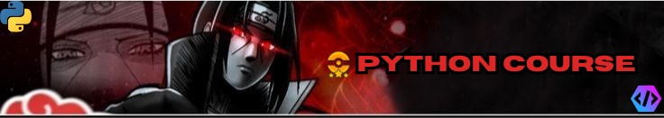

  
   
<strong>Collection of Notes and projects that i learned during my python journey.</strong>

  
  
  
  
  

---

# Python Learning Journey

Welcome to my Python Learning Journey repository! This repository is a comprehensive collection of everything I learned in my Python journey, starting from the basics and progressing to more advanced topics and projects. Whether you're a beginner or someone looking to brush up on your Python skills, this repository has something for you.